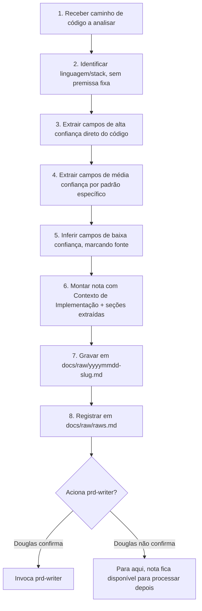

# Skill: PRD from Code — engenharia reversa de código para documentação

## Propósito

`grill-product` documenta o que ainda vai ser construído. `prd-writer`
documenta a partir de uma decisão já tomada. Esta skill documenta o que **já
existe e roda** — código sem PRD correspondente, ou PRD desatualizado em
relação ao que o código realmente faz hoje.

> [!IMPORTANT]
> Regra de ouro herdada do prd-writer, com uma nuance própria: código é fato
> sobre o quê e como, nunca sobre porquê. Extrair comportamento implementado
> é seguro. Inferir a intenção de negócio por trás dele é suposição — e toda
> suposição desta skill carrega a marca `[suposição — inferido de: <fonte>]`,
> nunca é apresentada como decisão confirmada.

## Camadas de confiança

Cada campo do bloco de descoberta tem uma origem diferente — isso não é
opcional, é o que evita que uma suposição vire fato só porque foi a
primeira coisa escrita no PRD:

**Extraído — fato direto do código, sem inferência:**
- O que, Como, Dependências
- Interface, Usuários (se houver role/auth explícito), Ações, Fluxo Normal,
  Fluxos Alternativos, Critérios de Aceite (camada Backend/BD sempre;
  camada Tela se houver frontend identificável), Diagrama de Sequência,
  Dados

**Extraído por padrão específico — existe se o padrão existir no código,
senão fica `[não encontrado no código]`, nunca vira suposição forçada:**
- Persona (via role/auth)
- Métrica (via chamada de analytics/log explícita)
- Eval spec (via harness de teste/golden set nos arquivos de teste — só
  relevante se o código tiver componente probabilístico)

**Inferido — só comentário, docstring, nome de função/variável, mensagem de
commit; sempre marcado com a fonte:**
- Porque, Objetivo, Fora de escopo

**Não aplicável — nunca inferido, nunca perguntado:**
- Evidência: `[não aplicável — código já existente, não há decisão futura a
  validar]`. O conceito de "prova de que vale a pena construir" não existe
  para algo que já foi construído.

## Fluxo



### Passo 1–2: Escopo e Identificação
- Receber de Douglas o caminho de arquivo(s) ou diretório a analisar.
- Identificar linguagem e estrutura (rotas/handlers, componentes de UI,
  queries/schema de banco, arquivos de teste) sem assumir um stack fixo —
  esta skill precisa funcionar em qualquer linguagem.

### Passo 3: Extração de Alta Confiança
Ler o código e preencher, como fato observado, sem interpretação de
intenção:
- **O que**: o que a função/rota/módulo faz, em uma frase.
- **Como**: o mecanismo — não a intenção, o mecanismo.
- **Dependências**: imports, chamadas a API externa, variáveis de ambiente,
  outros módulos/serviços referenciados.
- **Interface, Usuários, Ações, Fluxo Normal, Fluxos Alternativos**: mapear
  cada branch condicional relevante como um fluxo alternativo — um `if` de
  validação que rejeita uma entrada é, por definição, um fluxo alternativo
  já implementado.
- **Critérios de Aceite — Backend/BD**: o comportamento de banco/API já
  implementado, escrito no formato Dado/Quando/Então.
- **Critérios de Aceite — Tela**: idem, só se houver código de frontend
  identificável no escopo analisado.
- **Diagrama de Sequência**: a cadeia de chamadas real (função → API →
  banco), não uma cadeia idealizada.
- **Dados**: schema real das tabelas/modelos envolvidos — nomes de campo,
  tipo, constraints, exatamente como estão no código, não como deveriam
  estar.

### Passo 4: Extração de Média Confiança
- **Persona**: procurar checagem de role/permissão/auth no código. Se
  achar, extrair o perfil literal (ex: "usuário com role admin"). Se não
  achar, `[não encontrado no código]`.
- **Métrica**: procurar chamada explícita de analytics/telemetria/log
  estruturado. Se achar, essa é a métrica real sendo capturada hoje. Se não
  achar, `[não encontrado no código]`.
- **Eval spec**: só relevante se houver componente probabilístico no
  código. Procurar arquivo de teste com golden set, rubrica ou verificação
  de guardrail. Se achar, extrair. Se o código tem componente de IA mas não
  achar nada, `[não encontrado no código — componente de IA sem eval
  aparente]`, o que por si só é um achado relevante para o PM ver.

### Passo 5: Inferência de Baixa Confiança
- **Porque, Objetivo, Fora de escopo**: ler comentários, docstrings, nomes
  de função/variável, e mensagens de commit do histórico do arquivo, se
  disponível. Cada valor inferido leva a marca `[suposição — inferido de:
  <comentário na linha X / nome da função Y / commit "mensagem">]`. Se não
  houver nenhum sinal, `[não capturado — nenhum sinal encontrado no
  código]`, sem forçar uma suposição vazia.
- **Evidência**: sempre `[não aplicável — código já existente, não há
  decisão futura a validar]`.

### Passo 6: Montagem da Nota
Formato exato — mesmo cabeçalho de dez campos do `grill-product`, mais uma
seção de origem e as seções extraídas do template do PRD:

```markdown
## Contexto de Implementação
- **O que:** [extraído]
- **Porque:** [inferido, marcado, ou não capturado]
- **Evidência:** [não aplicável — código já existente, não há decisão futura a validar]
- **Objetivo:** [inferido, marcado, ou não capturado]
- **Como:** [extraído]
- **Persona:** [extraído, ou não encontrado no código]
- **Métrica:** [extraído, ou não encontrado no código]
- **Eval spec:** [extraído, ou não encontrado no código — omitir linha inteira se não houver componente de IA no código analisado]
- **Fora de escopo:** [inferido, marcado, ou não capturado]
- **Dependências:** [extraído]

## Origem de Código
- **Arquivos analisados:** [lista de paths]
- **Linguagem/stack identificada:** [...]
- **Commit/branch:** [se disponível]

## Interface (extraído)
[...]

## Usuários (extraído)
[...]

## Ações (extraído)
[...]

## Fluxo Normal (extraído)
[...]

## Fluxos Alternativos (extraído)
[...]

## Critérios de Aceite — Backend/BD (extraído)
[...]

## Critérios de Aceite — Tela (extraído, se houver frontend)
[...]

## Diagrama de Sequência (extraído)
​```mermaid
[...]
​```

## Dados (extraído)
[...]
```

### Passo 7: Gravação em `docs/raw`
Grava em `docs/raw/yyyymmdd-<slug>.md` — data do dia, slug derivado do
nome do módulo/função identificado no código (não do Objetivo, que aqui
costuma ser suposição, não fato confiável o bastante para nomear o
arquivo). Só grava com confirmação explícita de Douglas.

### Passo 8: Registro no Ledger
Mesmo mecanismo e mesmo formato de tabela que a `grill-product` usa. Se
`docs/raw/raws.md` não existir, criar com o cabeçalho:

```markdown
# Índice de Notas Brutas (docs/raw)

| Data/Hora | Arquivo | PRD |
| :--- | :--- | :--- |
```

Nova linha, coluna PRD vazia:

```markdown
| DD/MM/AAAA HH:MM | <nome-do-arquivo.md> | |
```

## Condição de Parada

Depois de gravar e registrar no ledger, perguntar se deve acionar o
`prd-writer` com a nota recém-criada. Não invocar sozinha — mesma regra do
`grill-product`.

## Distinto de

- **grill-product**: interroga um plano que ainda não existe, turno a
  turno, sempre com uma pergunta forçada e uma resposta recomendada. Esta
  skill não interroga — lê código e extrai/infere, sem diálogo turno a
  turno com Douglas durante a análise.
- **prd-writer**: escreve o PRD a partir de uma nota já pronta (desta
  skill, da grill-product, ou de nota crua). Esta skill produz a nota; não
  escreve PRD.
