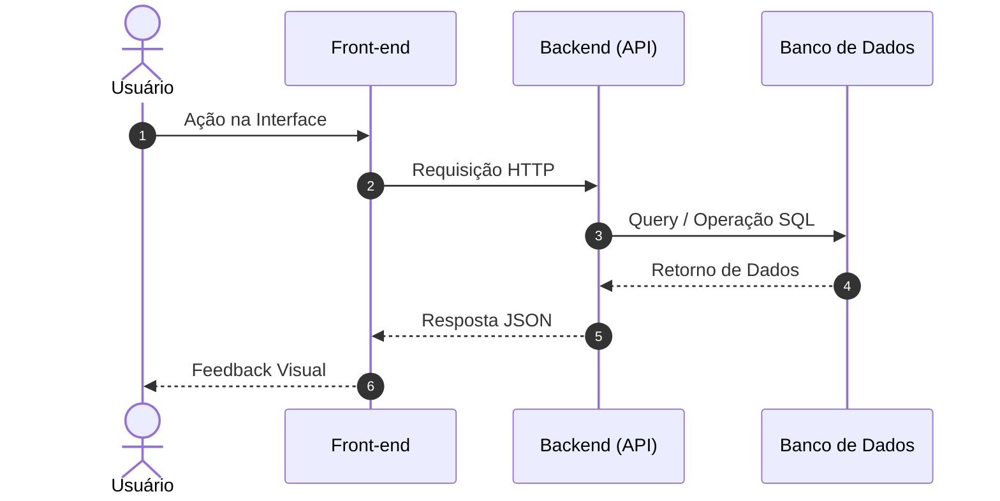

# Skill: Workflow de Documentação de Produto & Criação de PRDs

## 🎯 Propósito e Domínio

Esta Skill define o processo padronizado de engenharia de produto para transformar ideias brutas, requisitos informais e transcrições armazenados na pasta `docs/raw` em documentos de requisitos de produto prontos para implementação (`docs/prd`), além de manter atualizados os objetivos (`docs/prd/goals.md`) e personas (`docs/prd/personas.md`).

Ela garante que todo PRD siga o modelo **ARO (Ação-Resultado-Objeto)**, contenha rastreabilidade via **Histórico de Alterações**, **Contexto de Descoberta** (quando disponível), **Critérios de Aceite BDD em 3 Camadas** (*Negócio*, *Tela*, *Backend/BD*), **Diagramas de Sequência em Mermaid** e **Modelagem de Dados**.

> [!IMPORTANT]
> **Regra de ouro**: nunca assumir regra de negócio sem confirmação do PM. Se uma nota bruta for ambígua sobre uma regra de negócio, sempre perguntar antes de documentar como se fosse definitivo. Isso vale também para decisões de descoberta (outcome, evidência, escopo) — a única diferença é que, se essas decisões já foram travadas numa sessão de `grill-product`, a confirmação já aconteceu lá, e não precisa ser repetida aqui (ver Passo 0 e Passo 3).

---

## 🔄 Fluxo de Trabalho Passo a Passo

```mermaid
flowchart TD
    A0[0. Detectar Contexto de Descoberta na nota] --> A[1. Ler notas brutas em docs/raw]
    A --> B[2. Identificar módulo / funcionalidade]
    B --> B2[3. Extrair sinais de goals e personas]
    B2 --> C{PRD já existe (nome ou requisito)?}
    C -- Sim --> D[5. Editar PRD existente + Atualizar Histórico de Alterações]
    C -- Não --> E{Requisitos suficientes em docs/raw?}
    E -- Não --> F[Solicitar informações faltantes ao usuário]
    F --> G[Aguardar resposta do usuário]
    G --> H[6. Criar novo PRD no padrão ARO + BDD + Mermaid]
    E -- Sim --> H
    D --> I[7. Mover ou arquivar nota processada em docs/raw]
    H --> I
```

### Passo 0: Detecção de Contexto de Descoberta
Antes de tratar a nota como requisito puro, varrer o início do arquivo em busca de dois headers fixos — este é o contrato gravado pela skill `grill-product` quando ela interroga um plano antes de chegar aqui:

- **`## Contexto de Descoberta`** — se presente, contém até dez campos: `O que`, `Porque`, `Evidência`, `Objetivo`, `Como`, `Persona`, `Métrica`, `Eval spec` (opcional — só existe se o plano tiver componente de IA), `Fora de escopo`, `Dependências`. Extrair todos os campos presentes; tratá-los como decisões já confirmadas, não como sinal a ser reconfirmado.
- **`## Pendências de Descoberta`** — se presente, lista quais dos campos acima não foram resolvidos antes de a nota ser salva. Marcar internamente "descoberta incompleta" e guardar a lista — ela precisa aparecer no PRD final, não pode ser descartada.

Se nenhum dos dois headers existir, a nota não passou por grill prévio. Não bloquear nada — seguir para o Passo 1 normalmente, e preencher a seção `CONTEXTO DE DESCOBERTA` do template com os placeholders `[não capturado — nota processada sem grill prévio]` no Passo 6.

> [!IMPORTANT]
> Se a nota contiver `## Pendências de Descoberta`, o PRD resultante **não pode** apresentar essas lacunas como decisões fechadas. Copiar a mesma marcação de pendência para a seção `CONTEXTO DE DESCOBERTA` do PRD e para a primeira linha do **Histórico de Alterações**, avisando explicitamente que o PRD foi criado com descoberta incompleta. Nunca preencher a lacuna com uma suposição só para completar o documento.

### Passo 1: Leitura e Análise da Pasta `docs/raw`
- Varrer todos os arquivos `.md` e notas brutas dentro de `docs/raw`, exceto `docs/raw/raws.md` (esse é o ledger, não uma nota).
- Identificar se o conteúdo se refere a uma nova funcionalidade, ajuste de regra de negócio existente ou refatoração.
- **Checagem de ledger (acréscimo de segurança, não pedido originalmente pelo Douglas — remover se não for desejado):** para cada arquivo lido, verificar se ele já tem uma linha correspondente em `docs/raw/raws.md`. Se o arquivo `docs/raw/raws.md` não existir, criá-lo com este cabeçalho:

```markdown
# Índice de Notas Brutas (docs/raw)

| Data/Hora | Arquivo | PRD |
| :--- | :--- | :--- |
```

  Se a nota não tiver linha correspondente — normalmente porque não veio da `grill-product` (nota colocada manualmente, transcrição colada direto) — adicionar agora, com a coluna PRD vazia:

```markdown
| DD/MM/AAAA HH:MM | <nome-do-arquivo.md> | |
```

  Data/Hora, neste caso, é o momento em que o `prd-writer` percebeu o arquivo (não a criação real, que é desconhecida se não veio do grill). Isso garante que o ledger nunca fica incompleto, mesmo para notas que não passaram pelo grill.

### Passo 2: Identificação do Módulo / Funcionalidade
- Determinar a qual módulo ou funcionalidade a nota se refere, para saber em qual PRD ela deve entrar (novo ou existente).

### Passo 3: Extração de Sinais de Goals e Personas
Antes de seguir para o PRD, resolver goals e personas — o procedimento muda dependendo do que o Passo 0 encontrou:

- **Se o Passo 0 encontrou `Objetivo` e/ou `Métrica` preenchidos no Contexto de Descoberta**: essas branches já foram interrogadas e confirmadas na sessão de `grill-product` — a confirmação do PM já aconteceu lá. Não perguntar de novo. Verificar se já existe uma entrada equivalente em `docs/prd/goals.md`; se não existir, criar a entrada (formato abaixo); se existir mas o conteúdo mudou, atualizar. Informar ao usuário o que foi gravado, mas sem bloquear em confirmação.
- **Se o Passo 0 encontrou `Persona` preenchida no Contexto de Descoberta**: mesma regra — já confirmada no grill, criar ou enriquecer a entrada em `docs/prd/personas.md` sem reconfirmar, apenas informando.
- **Se a nota não passou por grill (Passo 0 não encontrou o header)**: aplicar o comportamento antigo — varrer a nota bruta em busca de sinal de objetivo de negócio novo/alterado ou persona nova/detalhe novo, e **sempre confirmar com o usuário antes de gravar** em `docs/prd/goals.md` ou `docs/prd/personas.md`. Goals e personas inferidos de nota crua, sem o crivo do grill, continuam exigindo confirmação explícita.

**Formato de entrada em `docs/prd/goals.md`** (arquivo único, uma entrada por goal):
```markdown
### [Nome curto do objetivo] — YYYY-MM-DD
- **Objetivo:** [descrição + número]
- **Métrica:** [métrica leading associada, se houver]
- **Origem:** PRD-XX <nome-do-modulo>
```

**Formato de entrada em `docs/prd/personas.md`** (arquivo único, uma entrada por persona):
```markdown
### [Nome/perfil da persona] — YYYY-MM-DD
- **Descrição:** [perfil, dor, contexto de uso]
- **Origem:** PRD-XX <nome-do-modulo>
```
Se a persona já existir, adicionar o novo detalhe à entrada existente em vez de duplicar.

> [!IMPORTANT]
> Se a nota bruta não contiver nenhum sinal de goal ou persona (nem via grill, nem via leitura direta), pule este passo silenciosamente — não é obrigatório que toda nota gere atualização nessas pastas.

### Passo 4: Verificação de Existência de PRDs em `docs/prd/`
- Verificar se já existe um arquivo `.md` correspondente ao módulo/funcionalidade na pasta `docs/prd/` — mas não parar na checagem por nome. O nome do módulo identificado no Passo 2 é uma etiqueta que a própria skill escolheu; duas raws sobre o mesmo requisito podem gerar nomes de módulo ligeiramente diferentes.
- **Verificação semântica (obrigatória, além do match por nome):** ler o título e a História de Usuário ARO de todos os PRDs em `docs/prd/` (e, se ainda houver dúvida, a seção AÇÕES) e avaliar se algum deles já trata o mesmo requisito descrito na raw sendo processada agora — mesmo sem coincidência de nome de arquivo. Isso vale especialmente ao tratar uma raw pendente (linha em `docs/raw/raws.md` com PRD em branco): antes de criar um PRD novo para ela, checar se algum PRD já existente não está, na prática, cobrindo o mesmo requisito.
- **Se Existir** (por nome ou por correspondência semântica): Proceder para a **Atualização Incremental (Passo 5)** no PRD encontrado — nunca criar um segundo PRD para o mesmo requisito. Isso concentra o tratamento do requisito num único arquivo, de forma evolutiva, em vez de fragmentar em múltiplos PRDs.
- **Se Não Existir** (nem por nome, nem por correspondência semântica): Proceder para a **Avaliação de Suficiência (Passo 5-Avaliação)**.

### Avaliação de Suficiência dos Requisitos
Antes de criar um novo PRD, verificar se a nota bruta contém elementos suficientes para preencher a estrutura obrigatória:
- Persona / Perfil do Usuário identificado.
- Regra de negócio ou ação principal.
- Comportamento esperado da interface (UI/UX).
- Impacto de dados / backend.

Notas que passaram pelo grill já resolvem Persona automaticamente (Passo 0/3); mesmo assim, regra de negócio, comportamento de UI e impacto de dados continuam precisando estar explícitos na nota — o grill não cobre esses três.

> [!IMPORTANT]
> **Ação em caso de Requisitos Insuficientes:**
> Se faltarem informações críticas (ex: regras em caso de falha, comportamento de borda), interromper a criação e fazer perguntas objetivas ao usuário listando exatamente os pontos que precisam de clarificação. Não prosseguir com suposições — nunca assumir regra de negócio sem confirmação do PM.

### Passo 5: Atualização Incremental de PRD Existente
- Abrir o arquivo existente em `docs/prd/`.
- Adicionar uma nova linha na tabela **Histórico de Alterações** no início do arquivo:
  `| DD/MM/YYYY HH:MM | <nome-do-arquivo-raw.md> | <usuário> | <descrição sucinta dos novos requisitos incorporados> |`
  A coluna RAW é sempre o arquivo de `docs/raw` que originou esta atualização específica — não o arquivo que originou a criação inicial do PRD, que já está na primeira linha da tabela.
- Se a nota trouxer `## Pendências de Descoberta`, adicionar isso como aviso na mesma linha do Histórico.
- Incorporar as novas regras nos campos correspondentes (Ações, Fluxos Alternativos, Critérios BDD, Diagrama de Sequência ou Tabela de Dados). Se a nota trouxer Contexto de Descoberta novo ou diferente do já registrado, atualizar a seção `CONTEXTO DE DESCOBERTA` do PRD também.

### Passo 6: Criação de Novo PRD (Padrão Obrigatório)
- Determinar o número sequencial `XX`: verificar todos os arquivos existentes em `docs/prd/` no padrão `PRD-XX-*.md`, identificar o maior número usado e incrementar em 1 (ex: se o maior existente é `PRD-07-...`, o novo é `PRD-08-...`). Se a pasta estiver vazia, começar em `01`.
- Criar um novo arquivo em `docs/prd/PRD-XX-<nome-do-modulo>.md` (nome do módulo em kebab-case).
- Preencher rigorosamente o **Template Padrão de PRD** descrito abaixo, incluindo a seção `CONTEXTO DE DESCOBERTA` com os valores extraídos no Passo 0, ou os placeholders `[não capturado — nota processada sem grill prévio]` se a nota não passou por grill. Na primeira linha do Histórico de Alterações, a coluna RAW é o nome do arquivo em `docs/raw` que está sendo processado agora — o mesmo que vai para a coluna Arquivo do ledger no Passo 7.

### Passo 7: Arquivamento da Nota Processada
- Após criar ou atualizar o PRD (e, se aplicável, goals/personas), mover ou marcar a nota de origem em `docs/raw/` como processada, para evitar reprocessamento duplicado.
- **Atualizar o ledger em `docs/raw/raws.md`**: localizar a linha cujo campo Arquivo corresponde à nota que acabou de ser processada, e preencher a coluna PRD com o nome do arquivo de PRD criado ou atualizado (ex: `PRD-08-nome-modulo.md`). Se a linha não existir ainda no ledger (nota que não passou pela `grill-product` e também não foi pega pela checagem do Passo 1), criá-la agora, já com a coluna PRD preenchida. Nunca deixar uma nota processada sem a coluna PRD marcada — é essa marcação que diferencia raw tratada de raw pendente.

---

## 📑 Template Padrão Obrigatório de um PRD

Todo PRD criado ou atualizado por esta Skill **DEVE** seguir exatamente esta estrutura de seções em Markdown:

```markdown
# PRD XX — [Nome do Módulo ou Funcionalidade]

## Histórico de Alterações

| Data Hora | RAW | Usuário | Descrição |
| :--- | :--- | :--- | :--- |
| DD/MM/YYYY HH:MM | <nome-do-arquivo-raw.md> | dsalazar | Criação inicial do PRD no modelo ARO e critérios BDD. |

---

## MODELO DE HISTÓRIA DE USUÁRIO ARO

### [Nome-da-User-Story-Modelo-ARO-Ação-Resultado-Objeto]
- **EU COMO** [persona]
- **QUANDO** [condição de disparo / tela]
- **QUERO** [ação executada]
- **PARA QUE EU POSSA** [objetivo de negócio / valor gerado]

---

## CONTEXTO DE DESCOBERTA

- **O que:** [herdado do Passo 0, ou "[não capturado — nota processada sem grill prévio]"]
- **Porque:** [herdado do Passo 0, ou "[não capturado — nota processada sem grill prévio]"]
- **Evidência:** [herdado do Passo 0, ou "[não capturado — nota processada sem grill prévio]"]
- **Objetivo:** [herdado do Passo 0, ou "[não capturado — nota processada sem grill prévio]"]
- **Como:** [herdado do Passo 0, ou "[não capturado — nota processada sem grill prévio]"]
- **Persona:** [herdado do Passo 0, ou "[não capturado — nota processada sem grill prévio]"]
- **Métrica:** [herdado do Passo 0, ou "[não capturado — nota processada sem grill prévio]"]
- **Eval spec:** [herdado do Passo 0, ou "[não capturado — nota processada sem grill prévio]"; linha inteira omitida se o PRD não tiver nenhum componente probabilístico]
- **Fora de escopo:** [herdado do Passo 0, ou "[não capturado — nota processada sem grill prévio]"]
- **Dependências:** [herdado do Passo 0, ou "[não capturado — nota processada sem grill prévio]"]

> ⚠️ Pendências de descoberta: [listar, só se a nota de origem trouxer `## Pendências de Descoberta` — e nesse caso, a linha do Histórico de Alterações também registra que este PRD foi criado com descoberta incompleta]

---

## INTERFACE

Seguir modelo padrão do sistema:
- **Páginas / Telas**: `[nome-da-pagina.html]`
- **Componentes visuais**: Descrição dos layouts, formulários, botões, modais e estados visuais.

---

## USUÁRIOS

- Lista dos perfis participantes do fluxo (ex: Usuário Anônimo, Usuário Registrado, Agendador Background).

---

## AÇÕES

### Ação 1: [Nome da Ação]
- **Objetivo**: Descrição da intenção da ação.
- **Resultado em caso de falha**: Comportamento e mensagem ao falhar.
- **Condição para sucesso**: Pré-requisitos para a ação ser concluída.
- **Condição para não sucesso**: Impeditivos de execução.

---

## FLUXO NORMAL

1. Passos ordenados em sequência numérica do caminho feliz (do início ao objetivo principal).

### CRITÉRIOS DE ACEITE — FLUXO NORMAL

#### Critério do Negócio
Cenário: [Nome do Cenário de Negócio]
Dado: [Contexto inicial de negócio]
Quando: [Ação ou evento de produto]
Então: [Resultado de negócio esperado]

#### Critérios Tela (Front-end)
Cenário: [Nome do Cenário de UI]
Dado: [Estado visual inicial da interface]
Quando: [Interação do usuário na tela]
Então: [Comportamento visual, feedback, validação ou animação]

#### Critérios Backend e Banco de Dados
Cenário: [Nome do Cenário de API / DB]
Dado: [Estado do banco de dados e requisição HTTP]
Quando: [Endpoint for acionado]
Então: [Status Code HTTP, alteração no banco e formato JSON de resposta]

---

## FLUXOS ALTERNATIVOS

### [Nome do Fluxo Alternativo ou Exceção]
1. Sequência numérica das ações do fluxo alternativo.

#### Critério do Negócio
Cenário: [Descrição do Cenário Alternativo]
Dado: [Condição de contorno ou exceção]
Quando: [Evento alternativo ocorrer]
Então: [Resultado de contingência esperado]

#### Critérios Tela (Front-end)
Cenário: [Feedback Visual de Erro/Alerta]
Dado: [Interface aguardando resposta]
Quando: [Ocorrer falha ou exceção]
Então: [Exibição de Toast, Modal de Erro ou Destaque nos Inputs]

#### Critérios Backend e Banco de Dados
Cenário: [Tratamento de Exceção no Backend]
Dado: [Requisição inválida ou erro em serviço externo]
Quando: [O backend capturar a exceção]
Então: [Status Code HTTP (400, 401, 422, 500) e Log de Erro]

---

## DIAGRAMA DE SEQUÊNCIA



---

## DADOS

| Campo | Significado / Descrição | Tipo de Dado | Tamanho / Constraint |
| :--- | :--- | :--- | :--- |
| `id` | Identificador único do registro | UUID | PRIMARY KEY |
| `nome_campo` | Descrição do propósito do dado | VARCHAR / NUMERIC | Constraints e nulos |
```

---

## 🎨 Regras de Qualidade e Boas Práticas (Verification Checklist)

1. **Nunca Duplicar PRDs**: Sempre checar se um PRD equivalente já existe — por nome de módulo E por conteúdo do requisito (Passo 4) — e optar por atualizar (Passo 5) em vez de criar um novo. Nome de arquivo diferente não é evidência de requisito diferente.
2. **Sempre Usar BDD de 3 Camadas**: Todo fluxo (Normal e Alternativos) **deve** possuir Critério do Negócio, Critérios Tela e Critérios Backend/BD nos blocos `Cenário:`, `Dado:`, `Quando:`, `Então:`.
3. **Diagrama Mermaid Válido**: Todos os diagramas devem usar a sintaxe limpa de `sequenceDiagram` contendo os atores relevantes.
4. **Sem Código-Fonte no Obsidian**: O PRD especifica o comportamento, contratos e tabelas; o código real permanece no repositório de desenvolvimento.
5. **Nunca Assumir Regra de Negócio**: Qualquer regra, condição de falha ou comportamento de borda que não esteja explícito na nota bruta deve ser perguntado ao usuário — nunca inferido silenciosamente.
6. **Goals e Personas exigem confirmação, exceto quando já vieram do grill**: Mudanças em `docs/prd/goals.md` e `docs/prd/personas.md` a partir de nota sem grill prévio nunca são gravadas automaticamente — sempre propor e aguardar confirmação do usuário antes de escrever. Quando o sinal já veio confirmado via `## Contexto de Descoberta` (grill-product), a gravação segue direto, sem reconfirmação (ver Passo 3).
7. **Contexto de Descoberta nunca apresenta pendência como decisão fechada**: se a nota trouxer `## Pendências de Descoberta`, isso tem que aparecer no PRD — no Histórico de Alterações e na seção CONTEXTO DE DESCOBERTA. Nunca omitir ou preencher a lacuna com suposição.
8. **Ledger `docs/raw/raws.md` sempre reflete a realidade**: toda nota processada tem a coluna PRD preenchida ao final do Passo 7. Uma linha com PRD vazio significa raw pendente; nunca deixar isso incorreto — é o mecanismo que Douglas usa para saber o que falta tratar.

## 🛑 Condição de Parada

O processamento de uma nota bruta é considerado completo quando: o PRD correspondente foi criado ou atualizado com todas as seções obrigatórias preenchidas (incluindo CONTEXTO DE DESCOBERTA), eventuais goals/personas identificados foram confirmados/gravados (via grill ou via confirmação direta) ou descartados pelo usuário, e a nota de origem foi arquivada. Se múltiplas notas estiverem na fila, processar uma de cada vez e repetir até que `docs/raw` não contenha mais notas pendentes.

## ⚠️ Escalação

Se, após pedir esclarecimento ao usuário sobre requisitos insuficientes, a resposta ainda não for suficiente para preencher os campos obrigatórios do template, não forçar a criação do PRD incompleto — deixar a nota em `docs/raw` marcada como "aguardando definição" e seguir para a próxima nota da fila, se houver.
