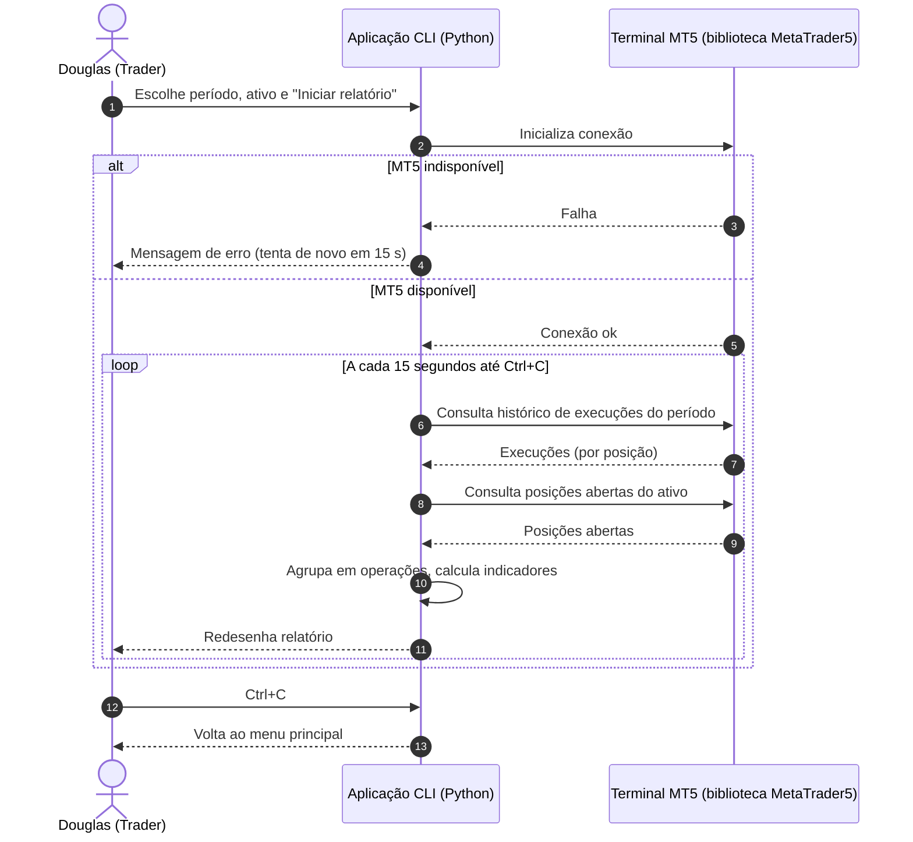

# PRD 01 — Relatório de Performance MT5 (CLI)

## Histórico de Alterações

| Data Hora | RAW | Usuário | Descrição |
| :--- | :--- | :--- | :--- |
| 02/10/2026 10:45 | 20261002-relatorio-performance-mt5-cli.md | dsalazar | Criação inicial do PRD no modelo ARO e critérios BDD. Regras de negócio confirmadas por Douglas em 02/10/2026 (respostas às 12 perguntas do prd-writer). Evidência (Q3 do grill) sem ocorrências datadas; ver CONTEXTO DE DESCOBERTA. |

---

## MODELO DE HISTÓRIA DE USUÁRIO ARO

### Consultar-Relatório-De-Performance-Atualizado
- **EU COMO** Douglas, trader pessoa física de WINFUT
- **QUANDO** abro o relatório de performance no terminal, escolhendo período e ativo
- **QUERO** ver resultado, indicadores das operações e posição atual, atualizados a cada 15 segundos a partir dos dados do MT5
- **PARA QUE EU POSSA** saber o resultado do dia e a posição atual em até 15 segundos, sem abrir nem interpretar o relatório nativo do MT5

---

## CONTEXTO DE DESCOBERTA

- **O que:** Um programa de terminal que lê do MetaTrader 5 as operações do dia (ou do período escolhido) e mostra, de forma clara e atualizada a cada 15 segundos, quanto Douglas ganhou ou perdeu e qual posição está aberta.
- **Porque:** Hoje não existe uma visão rápida e legível do resultado e da posição atual durante o pregão. O relatório nativo do MT5 é difícil de entender e não atualiza sozinho, então é preciso interpretá-lo manualmente enquanto se opera.
- **Evidência:** Problema recorrente relatado por Douglas (relatório nativo do MT5 difícil de entender), sem ocorrências datadas. Evidência fraca: não há 3+ ocorrências com data/contexto.
- **Objetivo:** Saber o resultado do dia e a posição atual em até 15 segundos, sem abrir nem interpretar o relatório do MT5, com os números batendo 100% com o histórico do MT5.
- **Como:** Aplicação Python de linha de comando, rodando no Windows junto ao terminal MT5. Conecta ao MT5 pela biblioteca oficial, lê o histórico de negociações do período escolhido e as posições abertas, calcula os indicadores e redesenha o relatório a cada 15 segundos. Um menu permite escolher o período (data inicial e final, sem horário) e o ativo (todos ou um específico).
- **Persona:** Douglas, trader pessoa física de WINFUT (mini-índice, B3), que opera com EAs e manualmente no MT5 e acompanha o resultado do dia durante o pregão.
- **Métrica:** (1) Divergência entre o resultado exibido e o histórico oficial do MT5 no mesmo período: meta R$ 0,00 em todos os dias conferidos. (2) Defasagem entre mudança de posição no MT5 e atualização na tela: no máximo 15 s.
- **Fora de escopo:** Enviar, modificar ou fechar ordens (somente leitura); interface gráfica ou web; gráficos, curva de capital e exportação (CSV/PDF); suporte a Profit (Nelogica); execução no macOS; histórico em banco de dados ou persistência entre execuções; múltiplas contas ou corretoras simultâneas; filtro por horário; **comissão, swap e taxas** (adicionado em 02/10/2026, ver Regras de Negócio).
- **Dependências:** Terminal MetaTrader 5 instalado, aberto e logado na conta, no Windows; Python e pacote `MetaTrader5` (só Windows) instalados nessa máquina; conta com histórico de negociações acessível pelo MT5. Nenhum outro PRD nem time externo. Validação só ocorre no Windows (CLAUDE.md).

> ⚠️ Pontos em aberto e defaults não confirmados explicitamente (revisar com Douglas):
> 1. **Virada de posição** (de comprado direto para vendido numa única execução): não foi definido se encerra uma operação e abre outra, ou se continua a mesma. Regra de "operação" confirmada: estar posicionado, de zero até voltar a zero, independente do lado e da quantidade.
> 2. **Conflito com a métrica 1:** como taxas ficam fora, o resultado exibido é o resultado bruto das operações. A divergência de R$ 0,00 só vale se a comparação com o MT5 também for feita sem comissão, swap e taxas.
> 3. **Sinal do prejuízo bruto:** exibido como valor negativo (default do PRD, não confirmado).
> 4. **Posição atual** ignora o filtro de período e respeita apenas o filtro de ativo (default do PRD, não confirmado).

---

## REGRAS DE NEGÓCIO

Confirmadas por Douglas em 02/10/2026:

| # | Regra |
| :--- | :--- |
| RN-01 | **Operação** é o intervalo em que o ativo permanece posicionado, de zero até voltar a zero, independente do lado (compra ou venda) e da quantidade de contratos. Execuções parciais pertencem à mesma operação. |
| RN-02 | **Resultado da operação** é o lucro ou prejuízo apurado pelas execuções da operação, **sem** comissão, swap e taxas (fora de escopo por ora). |
| RN-03 | Uma operação pertence ao período pela **data de fechamento**. Uma operação aberta num dia e fechada em outro entra no período do fechamento. |
| RN-04 | A data é considerada no **horário do servidor do MT5**. O período vai de 00:00:00 da data inicial até 23:59:59 da data final, inclusive. |
| RN-05 | Operação com resultado > 0 é vencedora; < 0 é perdedora; **= 0 conta na quantidade total de operações, mas não é vencedora nem perdedora**. |
| RN-06 | **Lucro bruto** = soma dos resultados das operações vencedoras. **Prejuízo bruto** = soma dos resultados das perdedoras. **Resultado total** = lucro bruto + prejuízo bruto. |
| RN-07 | **Fator de lucro** = lucro bruto ÷ valor absoluto do prejuízo bruto. Sem prejuízo no período (divisão por zero), exibir "—" (indefinido), nem infinito nem zero. |
| RN-08 | O **resultado total não inclui** o lucro/prejuízo flutuante da posição aberta. Só operações fechadas entram nos indicadores. |
| RN-09 | **Posição atual** é exibida **uma por ativo** posicionado: Tipo (Compra ou Venda), Quantidade, Preço médio (preço de abertura da posição no MT5) e Lucro/Prejuízo (flutuante). Sem posição aberta, exibir "Sem posição". |
| RN-10 | O **ativo** é escolhido de uma lista numerada dos ativos com negociação no período, mais a opção "Todos". Não há digitação livre de símbolo. |
| RN-11 | O **período padrão** é hoje (data inicial = data final = data atual do servidor) e o ativo padrão é "Todos". |
| RN-12 | A atualização ocorre a cada **15 segundos** enquanto o relatório está aberto. |

---

## INTERFACE

Aplicação de linha de comando (sem HTML). Telas do terminal:

- **Páginas / Telas**: `Menu principal`, `Seleção de período`, `Seleção de ativo`, `Relatório de performance`.
- **Menu principal**: exibe o período e o ativo atualmente selecionados e as opções `(1) Período`, `(2) Ativo`, `(3) Iniciar relatório`, `(0) Sair`.
- **Seleção de período**: pede data inicial e data final no formato `DD/MM/AAAA`.
- **Seleção de ativo**: lista numerada de ativos, mais a opção "Todos".
- **Relatório de performance**: tela redesenhada a cada 15 s, com as linhas Resultado total, Lucro bruto, Prejuízo bruto, Quantidade de operações, Quantidade de operações vencedoras, Quantidade de operações perdedoras, Fator de lucro, e o bloco Posição atual (Tipo, Quantidade, Preço médio, Lucro/Prejuízo). Exibe o horário da última atualização e a indicação de que `Ctrl+C` volta ao menu.
- **Estados visuais**: relatório normal; sem posição ("Sem posição"); sem operações no período (valores zerados e fator "—"); erro de conexão com o MT5 (mensagem na tela, mantendo o ciclo de 15 s).

---

## USUÁRIOS

- Douglas (trader pessoa física de WINFUT), único perfil do fluxo.
- Terminal MetaTrader 5 (sistema externo consultado, somente leitura).

---

## AÇÕES

### Ação 1: Selecionar período
- **Objetivo**: Definir data inicial e final do relatório.
- **Resultado em caso de falha**: Exibir mensagem de erro e pedir a data novamente. O período anterior é mantido.
- **Condição para sucesso**: Ambas as datas no formato `DD/MM/AAAA` e data final igual ou posterior à inicial.
- **Condição para não sucesso**: Formato inválido, data inexistente ou data final anterior à inicial.

### Ação 2: Selecionar ativo
- **Objetivo**: Restringir o relatório a um ativo ou acompanhar todos.
- **Resultado em caso de falha**: Exibir "Opção inválida" e pedir a escolha novamente.
- **Condição para sucesso**: Número escolhido existe na lista exibida.
- **Condição para não sucesso**: Número fora da lista ou entrada não numérica.

### Ação 3: Iniciar relatório
- **Objetivo**: Exibir os indicadores e a posição atual e mantê-los atualizados a cada 15 s.
- **Resultado em caso de falha**: Exibir a mensagem de erro na tela e tentar novamente após 15 s, sem encerrar o programa.
- **Condição para sucesso**: Terminal MT5 aberto, logado e acessível pela biblioteca Python.
- **Condição para não sucesso**: MT5 fechado, deslogado ou sem conexão.

### Ação 4: Voltar ao menu
- **Objetivo**: Sair do relatório e retornar ao menu principal.
- **Resultado em caso de falha**: Não se aplica.
- **Condição para sucesso**: `Ctrl+C` pressionado durante o relatório.
- **Condição para não sucesso**: Nenhuma.

### Ação 5: Sair
- **Objetivo**: Encerrar a aplicação e a conexão com o MT5.
- **Resultado em caso de falha**: Não se aplica.
- **Condição para sucesso**: Opção `0` escolhida no menu principal.
- **Condição para não sucesso**: Nenhuma.

---

## FLUXO NORMAL

1. Douglas abre a aplicação. O menu principal mostra período "hoje" e ativo "Todos".
2. (Opcional) Escolhe `1`, informa data inicial e final em `DD/MM/AAAA`.
3. (Opcional) Escolhe `2` e seleciona um ativo da lista numerada ou "Todos".
4. Escolhe `3`. A aplicação conecta ao MT5, busca as operações fechadas no período e as posições abertas, calcula os indicadores e exibe o relatório.
5. A cada 15 segundos a aplicação consulta o MT5 de novo e redesenha o relatório.
6. Douglas pressiona `Ctrl+C` e volta ao menu principal.

### CRITÉRIOS DE ACEITE — FLUXO NORMAL

#### Critério do Negócio
Cenário: Indicadores do dia batem com as operações fechadas
Dado: O ativo WINV26 teve hoje 3 operações fechadas, com resultados +R$ 100,00, +R$ 50,00 e −R$ 30,00
Quando: Douglas inicia o relatório com período "hoje" e ativo "Todos"
Então: Lucro bruto = R$ 150,00; Prejuízo bruto = −R$ 30,00; Resultado total = R$ 120,00; Quantidade de operações = 3; vencedoras = 2; perdedoras = 1; Fator de lucro = 5,00

Cenário: Atualização a cada 15 segundos
Dado: O relatório está aberto
Quando: Uma operação é fechada no MT5
Então: O novo resultado aparece no relatório em até 15 segundos

#### Critérios Tela (Front-end)
Cenário: Exibição do relatório
Dado: Douglas está no menu principal e escolhe `3`
Quando: A primeira consulta ao MT5 é concluída
Então: A tela mostra Resultado total, Lucro bruto, Prejuízo bruto, Quantidade de operações, vencedoras, perdedoras, Fator de lucro e o bloco Posição atual, mais o horário da última atualização e a indicação de `Ctrl+C` para voltar

Cenário: Redesenho periódico
Dado: O relatório está aberto
Quando: Passam 15 segundos
Então: A tela é redesenhada com os valores atualizados e o novo horário de atualização

Cenário: Voltar ao menu
Dado: O relatório está aberto
Quando: Douglas pressiona `Ctrl+C`
Então: A atualização para e o menu principal é exibido com período e ativo preservados

#### Critérios Backend e Banco de Dados
Cenário: Consulta ao MT5 (sem banco de dados; nada é persistido)
Dado: A biblioteca `MetaTrader5` inicializada e o terminal logado
Quando: O relatório é aberto ou o ciclo de 15 s dispara
Então: A aplicação consulta o histórico de execuções do período (de 00:00:00 da data inicial a 23:59:59 da data final, horário do servidor) e as posições abertas do ativo escolhido, sem enviar, alterar ou cancelar nenhuma ordem

Cenário: Operação cruzando dias
Dado: Uma operação foi aberta ontem e fechada hoje, com execuções parciais em ambos os dias
Quando: O período é "hoje"
Então: A operação entra no período, com o resultado completo de todas as suas execuções, inclusive as de ontem

---

## FLUXOS ALTERNATIVOS

### Datas inválidas
1. Douglas escolhe `1` no menu.
2. Informa data em formato inválido, data inexistente ou data final anterior à inicial.
3. A aplicação rejeita com mensagem e pede as datas novamente.

#### Critério do Negócio
Cenário: Data final anterior à inicial
Dado: Douglas está informando o período
Quando: Informa data inicial 10/10/2026 e data final 09/10/2026
Então: O período não é alterado e Douglas é solicitado a informar as datas novamente

#### Critérios Tela (Front-end)
Cenário: Mensagem de data inválida
Dado: A tela de seleção de período está aguardando entrada
Quando: Douglas digita "2026-10-10" ou "31/02/2026"
Então: É exibida mensagem de erro indicando o formato `DD/MM/AAAA` e o campo é solicitado de novo

#### Critérios Backend e Banco de Dados
Cenário: Nenhuma consulta com período inválido
Dado: O período informado é inválido
Quando: A validação rejeita a entrada
Então: Nenhuma consulta é feita ao MT5 e o período anterior continua em uso

### MT5 indisponível
1. Douglas inicia o relatório, ou o ciclo de 15 s dispara com o MT5 fechado, deslogado ou sem conexão.
2. A aplicação exibe a mensagem de erro na tela.
3. A aplicação tenta novamente após 15 s, sem encerrar.

#### Critério do Negócio
Cenário: Recuperação automática
Dado: O MT5 foi fechado com o relatório aberto
Quando: O MT5 é reaberto e logado
Então: Na próxima tentativa (até 15 s depois) o relatório volta a exibir os números atualizados

#### Critérios Tela (Front-end)
Cenário: Erro de conexão visível
Dado: O relatório está aberto
Quando: A consulta ao MT5 falha
Então: A tela exibe a mensagem de erro, mantém o aviso de `Ctrl+C` para voltar ao menu e continua tentando a cada 15 s

#### Critérios Backend e Banco de Dados
Cenário: Falha de inicialização ou consulta
Dado: A inicialização da biblioteca `MetaTrader5` ou a consulta retorna falha
Quando: A aplicação captura o erro
Então: O código/descrição do erro do MT5 é exibido, a aplicação não encerra e o próximo ciclo repete a tentativa

### Sem posição aberta ou sem operações no período
1. Douglas inicia o relatório e não há posição aberta e/ou operações fechadas no período.
2. A aplicação exibe "Sem posição" e/ou indicadores zerados.

#### Critério do Negócio
Cenário: Período sem operações
Dado: Não houve operações fechadas no período escolhido
Quando: Douglas inicia o relatório
Então: Resultado total, Lucro bruto, Prejuízo bruto e as quantidades são 0 e o Fator de lucro é "—"

#### Critérios Tela (Front-end)
Cenário: Sem posição aberta
Dado: Não há posição aberta no ativo escolhido
Quando: O relatório é exibido
Então: O bloco Posição atual mostra "Sem posição"

#### Critérios Backend e Banco de Dados
Cenário: Retorno vazio do MT5
Dado: A consulta de histórico ou de posições retorna vazio
Quando: A aplicação processa o retorno
Então: Não é tratado como erro; os indicadores são zerados e a exibição segue as regras RN-07 e RN-09

### Operação com resultado zero e fator de lucro indefinido
1. O período contém uma operação com resultado exatamente zero e/ou nenhuma operação perdedora.

#### Critério do Negócio
Cenário: Resultado zero
Dado: Há 4 operações no período, sendo uma com resultado exatamente R$ 0,00
Quando: O relatório é calculado
Então: Quantidade de operações = 4 e a operação de resultado zero não é contada como vencedora nem perdedora

Cenário: Sem prejuízo no período
Dado: Todas as operações do período foram vencedoras ou zero
Quando: O fator de lucro é calculado
Então: O Fator de lucro é exibido como "—"

#### Critérios Tela (Front-end)
Cenário: Exibição do fator indefinido
Dado: Prejuízo bruto = 0
Quando: O relatório é exibido
Então: O campo Fator de lucro mostra "—", nem "0" nem "∞"

#### Critérios Backend e Banco de Dados
Cenário: Divisão por zero evitada
Dado: Prejuízo bruto = 0
Quando: O cálculo do fator de lucro é executado
Então: Nenhuma exceção é gerada e o valor é tratado como indefinido

### Opção inválida no menu ou na lista de ativos
1. Douglas digita opção fora das listadas ou entrada não numérica.

#### Critério do Negócio
Cenário: Opção inexistente
Dado: O menu principal ou a lista de ativos está aberto
Quando: Douglas digita uma opção inexistente
Então: Nenhuma ação é executada e a escolha é pedida novamente

#### Critérios Tela (Front-end)
Cenário: Mensagem de opção inválida
Dado: Menu ou lista aguardando entrada
Quando: Douglas digita "9" ou "abc"
Então: É exibido "Opção inválida" e o mesmo menu ou lista é exibido de novo

#### Critérios Backend e Banco de Dados
Cenário: Sem efeito no MT5
Dado: Entrada inválida
Quando: A validação rejeita a entrada
Então: Nenhuma consulta é disparada ao MT5

---

## DIAGRAMA DE SEQUÊNCIA

---

## DADOS

Não há banco de dados nem persistência (fora de escopo). A tabela descreve os dados mantidos em memória durante a execução.

| Campo | Significado / Descrição | Tipo de Dado | Tamanho / Constraint |
| :--- | :--- | :--- | :--- |
| `data_inicial` | Primeira data do período (00:00:00, horário do servidor) | Data | Obrigatório; padrão: hoje |
| `data_final` | Última data do período (até 23:59:59, horário do servidor) | Data | Obrigatório; ≥ `data_inicial`; padrão: hoje |
| `ativo` | Ativo filtrado, ou "Todos" | Texto | Obrigatório; padrão: "Todos" |
| `resultado_operacao` | Resultado de uma operação fechada, sem comissão, swap e taxas | Decimal | Pode ser negativo, zero ou positivo |
| `resultado_total` | Lucro bruto + prejuízo bruto | Decimal | Não inclui flutuante |
| `lucro_bruto` | Soma dos resultados das operações vencedoras | Decimal | ≥ 0 |
| `prejuizo_bruto` | Soma dos resultados das operações perdedoras | Decimal | ≤ 0 |
| `qtd_operacoes` | Operações fechadas no período, incluindo as de resultado zero | Inteiro | ≥ 0 |
| `qtd_vencedoras` | Operações com resultado > 0 | Inteiro | ≥ 0 |
| `qtd_perdedoras` | Operações com resultado < 0 | Inteiro | ≥ 0 |
| `fator_lucro` | Lucro bruto ÷ \|prejuízo bruto\| | Decimal | Indefinido ("—") quando prejuízo bruto = 0 |
| `posicao_tipo` | Compra ou Venda | Texto | Obrigatório se há posição |
| `posicao_quantidade` | Volume da posição aberta | Decimal | > 0 |
| `posicao_preco_medio` | Preço de abertura da posição no MT5 | Decimal | > 0 |
| `posicao_lucro_prejuizo` | Lucro ou prejuízo flutuante da posição | Decimal | Pode ser negativo |
| `intervalo_atualizacao` | Intervalo entre consultas ao MT5 | Inteiro (segundos) | Fixo em 15 |
